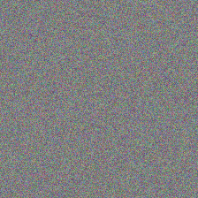

# Style Transfer

  

Repository dedicated to implementing the style transfer technique for styling content images. This technique was introduced by Leon A. Gatys et al. through the article ["A Neural Algorithm of Artistic Style"](https://arxiv.org/abs/1508.06576) back in 2015.

## Repository Structure

- **gifs/:** Folder containing GIF results obtained by the Colab notebooks.

- **content_representation.ipynb:** Extracts only the content from the content image and transfers it to the generated image using the features map of VGG16, as suggested by the paper.

- **style_representation.ipynb:** Extracts only the style from the style image using the Gram matrices, as suggested by the original paper.

- **style_transfer.ipynb:** Complete implementation of the style transfer technique, aiming to transfer both the style from the style image and the content from the content image to the generated image.

## Gif Previews

### Style Representation


### Content Representation


### Style Transfer Results


## Dependencies

Ensure you have the following dependencies installed before running the notebooks:

- [tensorflow==2.14.0](https://pypi.org/project/tensorflow/2.14.0/)
- [numpy==1.23.5](https://pypi.org/project/numpy/1.23.5/)
- [matplotlib==3.7.1](https://pypi.org/project/matplotlib/3.7.1/)
- [tqdm==4.66.1](https://pypi.org/project/tqdm/4.66.1/)

Install them using:

```bash
pip install tensorflow==2.14.0 numpy==1.23.5 matplotlib==3.7.1 tqdm==4.66.1
